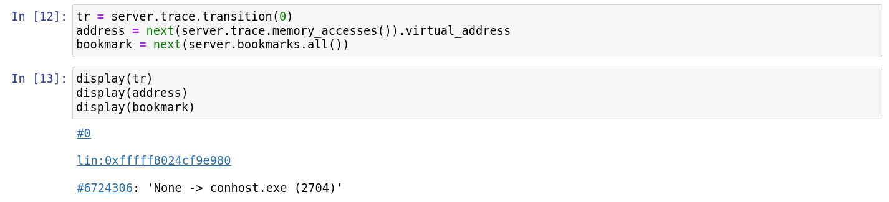
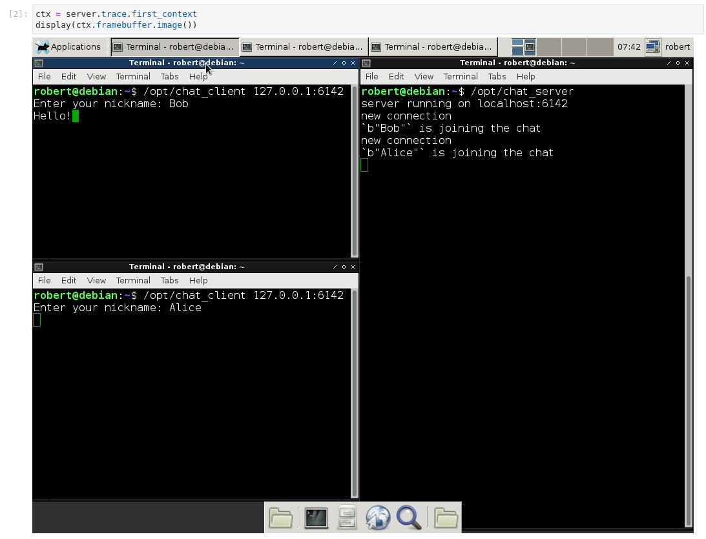
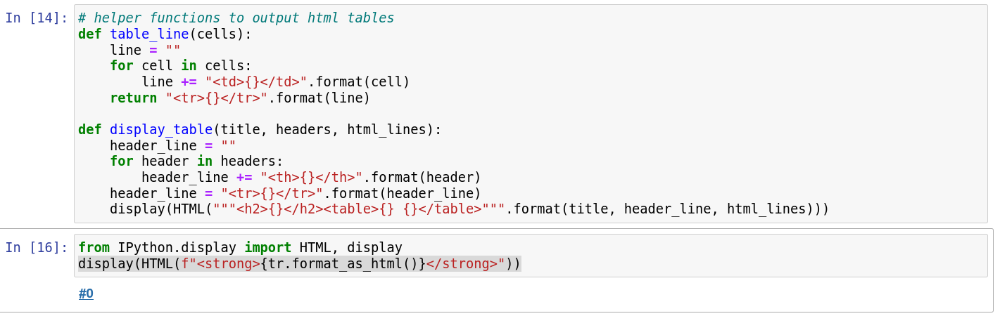
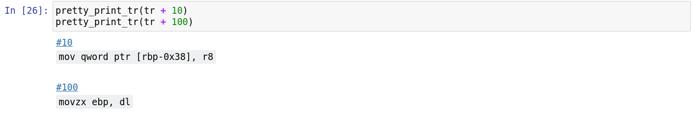
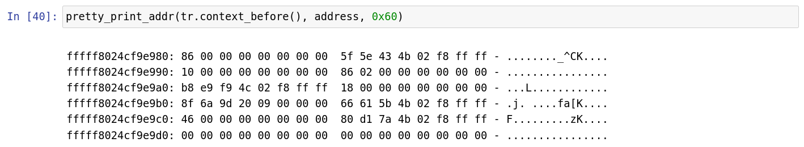



# Displaying data nicely in Jupyter notebooks

## Detecting if the script is executed in a notebook or not

```py
def in_notebook():
    """
    Detect if we are currently running a Jupyter notebook.

    This is used to display rendered results inline in Jupyter when we are
    executing in the context of a Jupyter notebook, or to display raw results
    on the standard output when we are executing in the context of a script.
    """
    try:
        from IPython import get_ipython  # type: ignore

        if get_ipython() is None or ("IPKernelApp" not in get_ipython().config):
            return False
    except ImportError:
        return False
    return True
```

## Displaying a transition, address as a synchronization link

{{ bulma::begin_bulma() }}
{{ bulma::tags(tags=[
    bulma::reven_version(version="v2.5.0"),
    bulma::jupyter_tag(),
]) }}
{{ bulma::end_bulma() }}

```py
display(tr)
display(address)
display(bookmark)
```

Sample output:



## Displaying a screenshot from the trace

{{ bulma::begin_bulma() }}
{{ bulma::tags(tags=[
    bulma::reven_version(version="v2.12.0"),
    bulma::jupyter_tag(),
]) }}
{{ bulma::end_bulma() }}

```py
ctx = server.trace.first_context
display(ctx.framebuffer.image())
```

Sample output:



## Displaying in tables

```py
# helper functions to output html tables
def table_line(cells):
    line = ""
    for cell in cells:
        line += "<td>{}</td>".format(cell)
    return "<tr>{}</tr>".format(line)

def display_table(title, headers, html_lines):
    header_line = ""
    for header in headers:
        header_line += "<th>{}</th>".format(header)
    header_line = "<tr>{}</tr>".format(header_line)
    display(HTML("""<h2>{}</h2><table>{} {}</table>""".format(title, header_line, html_lines)))
```

## Pretty printing

### Basics

{{ bulma::begin_bulma() }}
{{ bulma::tags(tags=[
    bulma::reven_version(version="v2.7.0"),
    bulma::jupyter_tag(),
]) }}
{{ bulma::end_bulma() }}

```py
from IPython.display import HTML, display
display(HTML(f"<strong>{tr.format_as_html()}</strong>"))
```

Sample output:



### Transition


{{ bulma::begin_bulma() }}
{{ bulma::tags(tags=[
    bulma::reven_version(version="v2.5.0"),
    bulma::jupyter_tag(),
]) }}
{{ bulma::end_bulma() }}

```py
import reven2
from IPython.display import HTML, display
import re
import itertools
import html

all_regs = {}
for reg in reven2.arch.helpers.x64_registers():
    all_regs[reg.name] = reg

def tokenize_string(string):
    return re.split(" |dword|ptr|\\[|\\]|\\+|\\*|,", string)

def tokenize_instruction(transition):
    if transition.instruction is None:
        return []
    return tokenize_string(str(transition.instruction))

def get_pretty_print_tr(tr, show_context=False, show_symbol=False):
    output = ""
    if show_symbol:
        output += "<span>{}</span><br/>".format(html.escape(str(tr.context_before().ossi.location())))

    output += tr._repr_html_()
    output += " <code>{}</code>".format(str(tr).split(" ", 1)[1])
    output += "<br/>"

    if not show_context:
        return '<p style="font-family:monospace" class="tex2jax_ignore">' + output + "</p>"

    instr_elements = tokenize_instruction(tr)
    done_already = []
    print_data = []
    for elem in instr_elements:
        if elem in done_already:
            continue
        done_already.append(elem)
        if elem in all_regs:
            before = tr.context_before().read(all_regs[elem])
            after = tr.context_after().read(all_regs[elem])
            if before == after or elem in ["rip"]:
                print_data.append("{} = {:x}".format(elem, before))
            else:
                print_data.append("{} = {:x} to {:x}".format(elem, before, after))

    output += ", ".join(print_data) + "<br/>"
    print_data = []

    max_items = 4
    accesses = list(itertools.islice(tr.memory_accesses(), max_items))
    for acc in accesses:
        elem = "{}[{:#x}]:{}".format("R" if acc.operation == reven2.memhist.MemoryAccessOperation.Read else "W",
                                     acc.virtual_address.offset,
                                     acc.size)
        try:
            before = tr.context_before().read(acc.virtual_address, acc.size)
            after = tr.context_after().read(acc.virtual_address, acc.size)
            if before == after:
                print_data.append("{} = {:x}".format(elem, before))
            else:
                print_data.append("{} = {:x} to {:x}".format(elem, before, after))
        except:
            print_data.append(elem + " = ?")

    if len(accesses) > max_items:
        print_data.append("...")
    output += ", ".join(print_data)

    return '<p style="font-family:monospace" class="tex2jax_ignore">' + output + "</p>"

def pretty_print_tr(tr, show_context=False, show_symbol=False):
    display(HTML(get_pretty_print_tr(tr, show_context=show_context, show_symbol=show_symbol)))
```

Sample output:



### Address / Hexdump

{{ bulma::begin_bulma() }}
{{ bulma::tags(tags=[
    bulma::reven_version(version="v2.5.0"),
    bulma::jupyter_tag(),
]) }}
{{ bulma::end_bulma() }}

Pretty print the content of a buffer at a specified address, in 0x10 increments.
If passed a register, it will be dereferenced.

```py
import reven2
from reven2.address import LinearAddress  # shortcut when reading addresses
from IPython.display import HTML, display

def print_buffer(b, addr=0, col=16, highlights = []):
    style_highlight = '<span style="background-color:yellow">'
    style_highlight_off = '</span>'
    output = '<code style="background-color:white">\n'

    prev_all_zeros = 0
    for i in range(int(len(b) / col)):

        total_sum = sum(b[i*col:(i+1)*col])
        for h in highlights:
            if h in range(i*col,col):
                total_sum = 0

        total_sum_next = sum(b[(i+1)*col:(i+2)*col])
        if total_sum == 0:
            prev_all_zeros += 1
        else:
            prev_all_zeros == 0
        if prev_all_zeros > 0 and total_sum_next == 0 and len(b) >= (i+2)*col:
            if prev_all_zeros == 1:
                output += "...\n"
            continue

        output += "{:016x}:".format(i*col + addr)

        for j in range(col):
            offset = j + i*col

            if offset >= len(b):
                break
            if j % 8 == 0:
                output += " "

            total_sum += b[offset]
            if offset in highlights:
                output += style_highlight
            output += "{:02x}".format(b[offset])
            if offset in highlights:
                output += style_highlight_off
            output += " "

        output += "- "
        for j in range(col):
            offset = j + i*col
            if offset >= len(b):
                break
            c = b[offset]

            if offset in highlights:
                output += style_highlight

            if c >= 32 and c <= 126:
                output += "{}".format(chr(c))
            else:
                output += "."

            if offset in highlights:
                output += style_highlight_off
        output += "\n"
    output += "</code>"
    display(HTML(output))

def pretty_print_addr(ctx, address, size):
    if isinstance(address, reven2.arch.register.Register):
        address = ctx.read(address)
    if isinstance(address, int):
        address = LinearAddress(address)
    print_buffer(ctx.read(address, size), address.offset)
```

Sample output:


