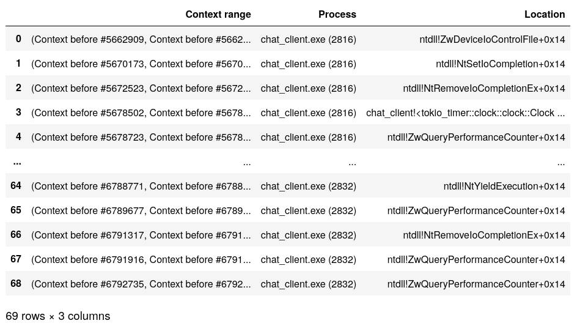
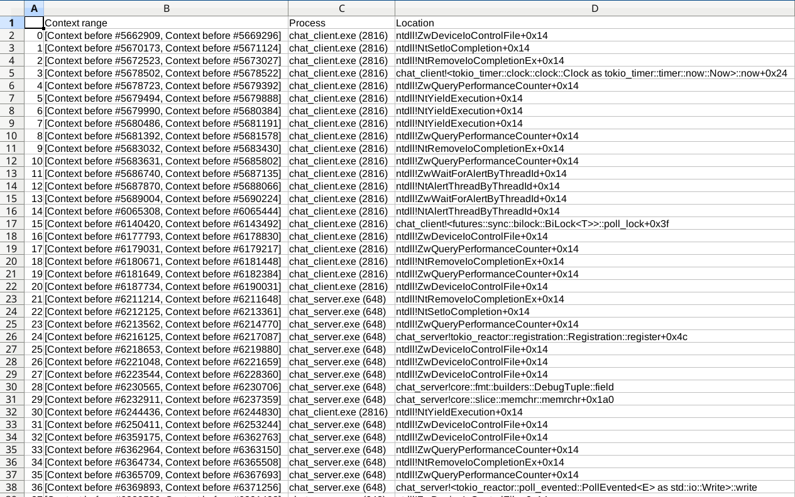



# Exporting tabular data to work with reporting tools

## Pre-requisites: install pandas

{{ bulma::begin_bulma() }}
{{ bulma::tags(tags=[
  bulma::reven_version(version="v2.9.0"),
  bulma::jupyter_tag()
]) }}
{{ bulma::end_bulma() }}

This example requires the `pandas` Python package:

```py
# From a code cell of a Jupyter notebook
try:
    import pandas
    print("pandas already installed")
except ImportError:
    print("Could not find pandas, attempting to install it from pip")
    import sys

    output = !{sys.executable} -m pip install pandas; echo $?  # noqa
    success = output[-1]

    for line in output[0:-1]:
        print(line)

    if int(success) != 0:
        raise RuntimeError("Error installing pandas")
    import pandas
    print("Successfully installed pandas")
```

## Building tabular data from filters

{{ bulma::begin_bulma() }}
{{ bulma::tags(tags=[
  bulma::reven_version(version="v2.10.0"),
  bulma::dependency_tag(name="pandas"),
]) }}
{{ bulma::end_bulma() }}


```py
res = []

header = ["Context range", "Process", "Location"]

processes = list(server.ossi.executed_processes("chat"))
for ctx_range in server.trace.filter(processes, reven2.filter.RingPolicy.R3Only):
    first_context = next(iter(ctx_range))
    res.append((ctx_range,
                first_context.ossi.process(),
                first_context.ossi.location()))

df = pandas.DataFrame.from_records(res, columns=header)
```

## Displaying tabular data in a Jupyter notebook

{{ bulma::begin_bulma() }}
{{ bulma::tags(tags=[
  bulma::reven_version(version="v2.9.0"),
  bulma::jupyter_tag(),
  bulma::dependency_tag(name="pandas"),
]) }}
{{ bulma::end_bulma() }}

```py
res = []

header = ["Context range", "Process", "Location"]

processes = list(server.ossi.executed_processes("chat"))
for ctx_range in server.trace.filter(processes, reven2.filter.RingPolicy.R3Only):
    first_context = next(iter(ctx_range))
    res.append((ctx_range,
                first_context.ossi.process(),
                first_context.ossi.location()))

df = pandas.DataFrame.from_records(res, columns=header)

# display table truncated in the middle
display(df)
```

Sample output:



## Exporting tabular data to csv

{{ bulma::begin_bulma() }}
{{ bulma::tags(tags=[
  bulma::reven_version(version="v2.10.0"),
  bulma::dependency_tag(name="pandas"),
]) }}
{{ bulma::end_bulma() }}

```py
df.to_csv("data.csv")
```

This can then be opened in e.g. spreadsheet software:


